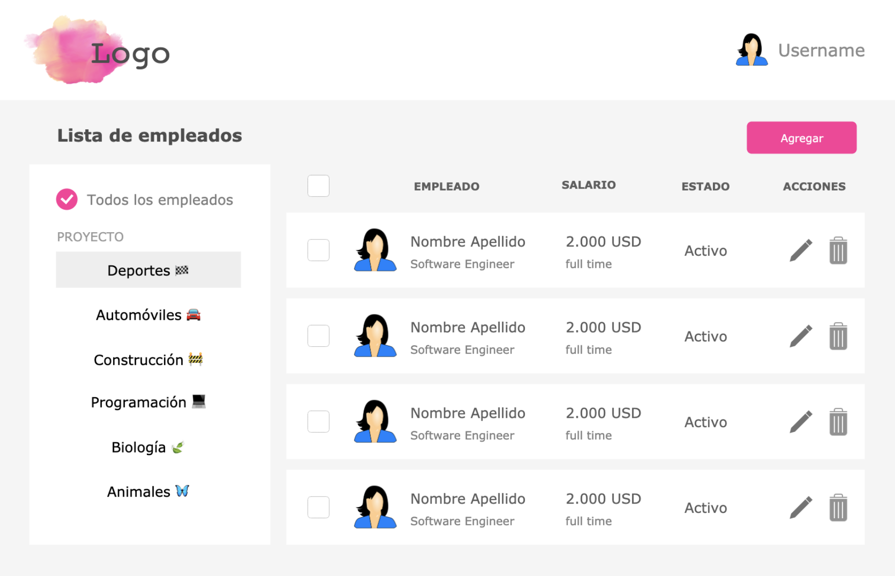

# Bussines Manager

Este sistema te va ayudar a administrar tus colaboradores, podrás ver en que proyecto esta cada uno, su nombre, sueldos, visualizar el total de los sueldos de tu nomina por proyecto, agregar colabores o eliminar de cada proyecto.

## Instalación 🔧

_Para instalar todas las dependencias del proyecto utiliza el siguiente comando_

```npm
npm install
```

_Para correr el proyecto utiliza el siguiente comando_

```npm
npm run start
```

## Mockup

Estes el mockup del proyecto.



## Construido con 🛠️

* [React](https://es.reactjs.org/) - La librería usada.
* [SASS](https://sass-lang.com/) - El preprocesador usado.
* [NPM](https://www.npmjs.com/) - Manejador de dependencias.
* [Webpack](https://webpack.js.org/) - Empaquetador de código.
* [Jest](https://jestjs.io/) - Sistema para pruebas usado.

## Autor ✒️

* **Humberto López** - *Creador* - [HumbertoMLL](https://github.com/HumbertoMLL)

* **Ana Belisa** -*Coach y proveedora del mockup* - [anabelisam](https://github.com/anabelisam)

## Licencia 📄

Este proyecto está bajo la Licencia (MIT)

---
Creado ⌨️ con ❤️ por [HumbertoMLL](https://github.com/HumbertoMLL)